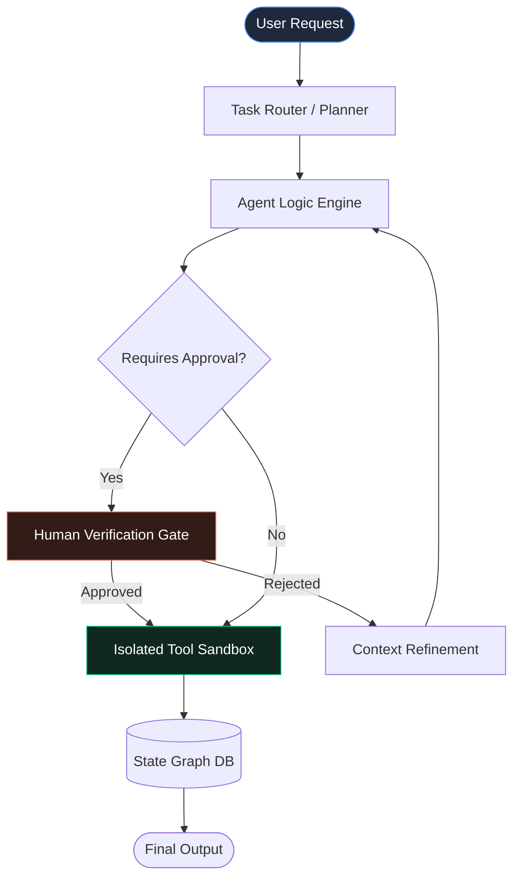

As Large Language Models (LLMs) evolve from reactive chatbots into autonomous agentic systems, software engineering leadership is shifting toward architecting robust execution sandboxes, state graphs, and human-in-the-loop governance.

## 1. The Evolution of Agentic Systems

Building autonomous workflows in enterprise environments requires far more than chaining API prompts. Production AI agents need deterministic guardrails, structured memory storage, and real-time execution safety.

> "An AI agent is only as reliable as the boundary conditions and inspection layers surrounding its tool execution environment."

## 2. Key Architectural Pillars

- **State Graph Orchestration:** Explicitly defining states, transitions, and fallback nodes rather than relying on unconstrained loops.
- **Tool Execution Sandboxing:** Running code execution, bash tasks, and database queries inside ephemeral, isolated environments.
- **Human-in-the-Loop Verification:** Requiring explicit authorization for high-consequence operations (e.g. production deployments, billing updates).
- **Observability & Replayability:** Logging exact JSON trajectories, tool inputs/outputs, and decision trees for compliance auditability.

## 3. Autonomous Execution Topology

Below is the state graph orchestration pattern used to safely process multi-agent tasks with human-in-the-loop governance:



## 4. Production Implementation Pattern

```typescript
// Example State Graph Node in TypeScript
interface AgentState {
  context: Record<string, any>;
  history: Message[];
  stepCount: number;
}

async function executeAgentStep(state: AgentState): Promise<AgentState> {
  const decision = await plannerModel.predict(state.context);
  
  if (decision.requiresHumanApproval) {
    return await requestHumanFeedback(state, decision);
  }
  
  return await runToolExecutionSandbox(state, decision.toolCall);
}
```

## Conclusion

The future of software architecture lies in seamless human-AI team workflows. By designing deterministic controls around generative models, organizations achieve both rapid velocity and enterprise safety.
