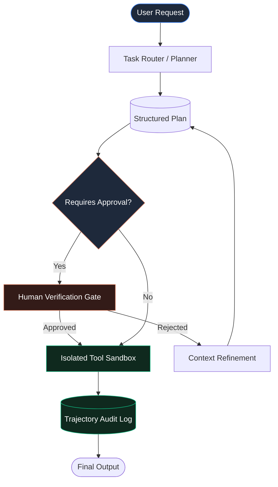

Every week I talk to teams that shipped a ChatGPT wrapper, declared victory, and then watched their "agent" quietly rot. The pattern is always the same, and it is never the model's fault.

> "An AI agent is only as reliable as the boundary conditions and inspection layers surrounding its tool execution environment."

The good news: the failures are structural, which means they are fixable — with architecture, not prayers.

## 1. The Three Ways Enterprise Agents Actually Die

**Death one: the demo-vs-production cliff.** A chatbot that answers questions is a calculator. An agent that reads your database, writes to your ticket system, triggers a deployment, or moves money is a new, untrusted user with direct tool access. The engineering bar is not higher — it is *categorically different*: sandboxing, authorization, audit, rollback.

**Death two: no state graph.** Most teams wire prompts directly to tools with `if/else` glue. The result is an unconstrained loop that cannot be inspected, resumed after a failure, or audited by compliance. Production agents need explicit states, transitions, and fallback nodes — not vibes.

**Death three: no human-in-the-loop gate.** When an agent is allowed to act on high-consequence operations (a production deploy, a billing update, a client-facing message) without explicit human approval, one mistake erases a year of trust.

## 2. The Architecture That Fixes All Three

The pattern I use in production is a **state-graph orchestrator with a mandatory human verification gate**:

### The three non-negotiables

- **Tool execution sandboxing.** Code, bash, and database queries run inside ephemeral, isolated environments with no write access to the host. The agent can break its sandbox all day — it cannot break *you*.
- **Explicit authorization boundaries.** Define, in advance, the action classes that require human approval. If it touches production, billing, or a client, it stops at the gate. No exceptions, no "the model seemed confident."
- **Full trajectory observability.** Log the exact JSON: the prompts, the tool inputs, the outputs, the decision path. You need to *replay* any decision for compliance auditability. If you cannot explain why the agent did something, you cannot ship it.

## 3. Where Most Teams Skip and Pay Later

They defer the **audit log** and the **authorization map** because the demo works without them. That is precisely the seductive trap: rename "demo" to "production," add a real user, and the missing governance instantly becomes a liability — a mysterious action with no owner, no explanation, no rollback.

Start with the boring parts. The sandbox and the audit trail are not overhead; they are the *product*. They are what make an autonomous system something a compliance officer, a CTO, and a CFO will each sign off on.

## 4. What This Looks Like in Practice

- **State graph orchestration** — explicit states, transitions, fallback nodes, resume-from-failure.
- **Tool execution sandboxing** — ephemeral, isolated, no host write access.
- **Human-in-the-loop verification** — mandatory approval for high-consequence operations.
- **Observability & replayability** — full JSON trajectory logs for compliance.

This is the difference between an agent that demos well and an agent that can be trusted with your production environment — or your clients'.

## Get the audit your team actually needs

If your team is building an AI agent (or already shipped one and is nervous), I'll spend 30 minutes reviewing your architecture and hand you a concrete list of the sandboxing, authorization, and observability gaps — what's production-safe and what isn't. No obligation.

You can reach me directly at **wisamdamouny@gmail.com** or through the contact form below.