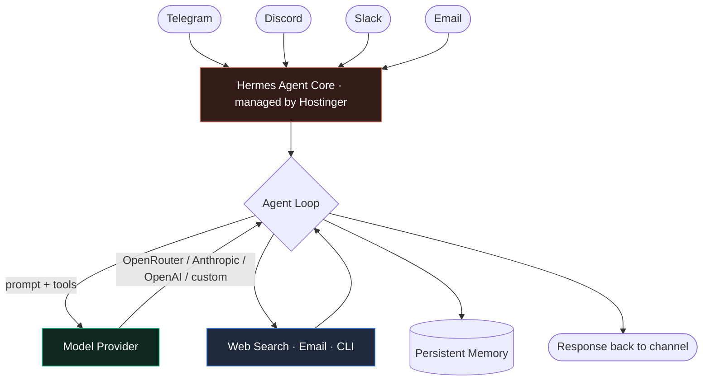

There is a widening gap between "chatbot" and "agent". A chatbot answers when spoken to. An agent has channels it listens on, tools it can call, memory that persists, and a loop that keeps running when you close the tab. Standing that up yourself means a VPS, a model runtime, a reverse proxy, a process manager, and a pile of glue code. **Hermes** collapses that into a single deployable unit — and Hostinger now offers it as a managed, one-click product.

## 1. What a Hermes agent actually is

Hermes is an autonomous, self-improving assistant rather than a single-purpose bot. The important properties:

- **Model-agnostic.** It targets 200+ LLMs through OpenRouter, or connects directly to Anthropic, OpenAI, or a custom endpoint. You are not locked to one provider.
- **Multi-channel.** The same agent instance can listen on Telegram, Discord, Slack, WhatsApp, and email — so it is reachable where work already happens.
- **Tool-using and persistent.** Web search, a pre-configured email identity, and CLI access come wired in; the agent keeps context across sessions instead of starting cold each time.
- **Self-maintaining.** On the managed plan, security patching and runtime upkeep are handled for you.

## 2. Managed vs. self-hosted — pick deliberately

| | Managed Hermes on Hostinger | Self-hosted on your own VPS |
|---|---|---|
| Time to running | Minutes, one click | An afternoon of setup |
| Maintenance | Handled (security, updates) | Yours |
| Model keys | Bring your own / included AI credits | Bring your own |
| Data path | Through Hostinger's managed stack | Entirely your box |
| Cost shape | Flat monthly | VPS + your inference bill |
| Best when | You want the agent, not the plumbing | You need full control or custom tooling |

If your goal is *"I want an agent in Telegram by tonight"*, the managed route is the right call. If you are building something bespoke around the agent — private tools, air-gapped data, a custom model server — jump to section 6.

<div style="border:1px solid var(--accent); border-radius:12px; padding:20px 24px; margin:32px 0; background:rgba(217,119,87,0.08);">
  <strong style="color:var(--fg); display:block; margin-bottom:8px;">Setting up an account</strong>
  <p style="margin:0; color:var(--fg-muted); font-size:16px;">This link opens the Hermes Agent <strong>Starter</strong> plan (12-month term) with <strong>20% off</strong> applied: <a href="https://www.hostinger.com/cart?product=hagents%3Astarter&amp;period=12&amp;referral_type=cart_link&amp;REFERRALCODE=NHJWISAMDKAY&amp;referral_id=01a04384-666a-7361-bf76-90025e9ce5a8" style="color:var(--accent); font-weight:600;">Hermes Agent Starter &rarr; 20% off</a>. At the time of writing it promotes around $5.99/mo (renewing higher on renewal) with a 30-day money-back guarantee — the <a href="https://www.hostinger.com/managed-hermes-agent" style="color:var(--accent); font-weight:600;">product page</a> has current numbers and the larger plans.</p>
</div>

## 3. The one-click deploy

From the [Managed Hermes Agent](https://www.hostinger.com/managed-hermes-agent) page — or straight to a discounted [Starter checkout](https://www.hostinger.com/cart?product=hagents%3Astarter&period=12&referral_type=cart_link&REFERRALCODE=NHJWISAMDKAY&referral_id=01a04384-666a-7361-bf76-90025e9ce5a8):

1. **Choose the plan and term**, then check out. The referral link applies the 20% discount at this step.
2. **Click Deploy** in hPanel. Hostinger provisions the server environment and the agent configuration together — there is no OS template to pick, no SSH session, no `docker compose`.
3. **Wait for "live"**. The agent comes up with its visual interface and a CLI you can reach from the panel.

That is the whole server-side story. Everything remaining is configuration inside the agent.

## 4. Connect a model provider

The agent needs an LLM behind it. You have three sane options:

- **OpenRouter** — one API key, 200+ models, easy A/B testing between them. Best default.
- **Direct Anthropic or OpenAI** — lower latency and often lower cost if you already know which model you want. Paste the provider key into the agent's model settings.
- **Custom endpoint** — point it at your own OpenAI-compatible server (vLLM, Ollama, a gateway). This is how you keep inference on infrastructure you control while still using the managed agent shell.

Included AI credits let you validate the setup before attaching your own billing.

## 5. Wire up channels

Each channel is a connector you enable and authorize:

- **Telegram** — create a bot with `@BotFather`, paste the token, done. This is the fastest channel to demo.
- **Discord / Slack** — register an app, grant the bot scopes, invite it to the workspace or server.
- **WhatsApp / email** — WhatsApp goes through the Business API; the managed plan ships a pre-configured email identity so the agent can send and receive without you standing up a mail server.

Start with one channel, confirm the round trip (message in → tool call → reply out), then add the rest.

## 6. Architecture



## 7. If you would rather self-host

The managed product is the agent shell as a service. To run the same shape yourself on a plain Hostinger KVM VPS — with a Nous Hermes 3 model, Ollama, and your own agent loop — I have a [full walkthrough here](self-hosted-hermes-agent-vps.html). The short version:

```bash
# Ubuntu 24.04 with Docker template — skips base setup
adduser hermes && usermod -aG sudo hermes
ufw allow OpenSSH && ufw allow 443/tcp && ufw enable

# Bring the agent up in a container, put Caddy in front for TLS
# Caddyfile:
#   hermes.example.com {
#       reverse_proxy 127.0.0.1:8080
#   }
```

You then supply the same things the managed plan configures for you: a model API key, channel tokens, and a process manager (systemd or Docker restart policy) so the loop survives reboots. You own the updates and the uptime in exchange for full control over the data path and the tool code.

> The decision is not technical, it is operational: do you want to be responsible for keeping an always-on service patched and alive? If not, pay for managed and spend the time on what the agent actually does.

## Conclusion

An autonomous agent used to be an infrastructure project. Hermes turns it into a product decision. Take the managed one-click deploy to get a Telegram-reachable agent running in minutes, bring your own model key so you control cost and quality, and only drop down to a self-hosted VPS when a real requirement — private tooling, data residency, a custom model server — forces the issue.

<p style="font-size:13px; color:var(--fg-subtle); font-style:italic; border-top:1px solid var(--card-border); padding-top:16px; margin-top:40px;">Affiliate disclosure: the Hostinger links in this article are referral links. Buying a plan through them gives you 20% off and may earn me a commission at no extra cost to you. Pricing and plan details reflect the Hostinger product page at the time of writing and may change.</p>
