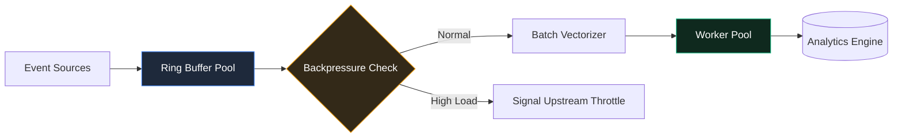

High-throughput data integration demands meticulous memory management, non-blocking asynchronous IO, and resilient backpressure mechanisms. In my work leading backend teams at Qlik, these principles form the core of enterprise data processing.

## 1. Managing Backpressure in Streaming Architectures

When ingest rates spike beyond downstream processing capacity, pipelines must gracefully throttle without dropping records or triggering out-of-memory crashes.

> "Unbounded memory buffering is the primary root cause of silent pipeline degradation at enterprise scale."

## 2. Pipeline Streaming Flow

The diagram below illustrates how events are ingested, buffered in ring pools, and processed across worker threads:

## 3. Core Technical Strategies

- **Ring Buffer Pools:** Pre-allocating fixed memory blocks to minimize Garbage Collector pressure under high throughput.
- **Batch Vectorization:** Processing records in SIMD-friendly vector chunks rather than record-by-record iteration.
- **Partition Sharding:** Distributing stateful aggregations dynamically across consumer worker threads.

## 4. Summary

High-performance data pipelines require relentless optimization of zero-copy data structures and event-loop efficiency to deliver reliable real-time analytics.
