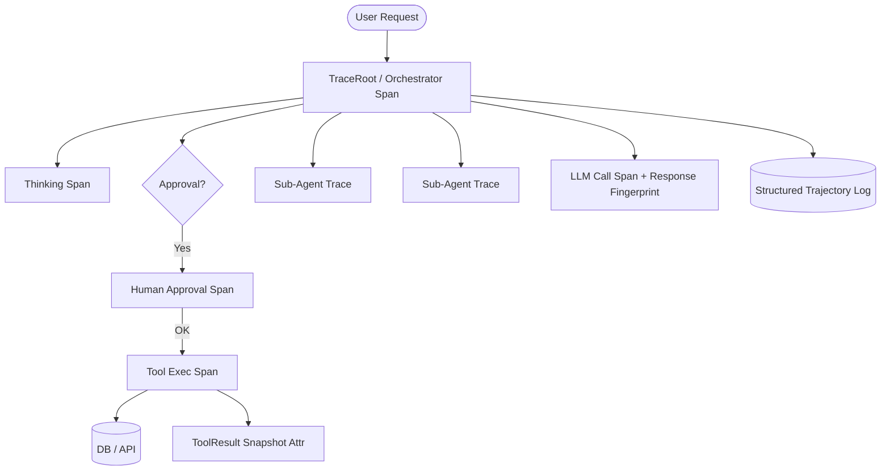

When your multi-agent system works in the demo but nobody can explain, in plain terms, *what one of its autonomous steps actually did in the last hour* — that is not an engineering small-print problem, that is a production blocker. Auditors, compliance officers, and increasingly the customers themselves will ask a question that no accuracy benchmark can answer: **"Prove it."**

Most teams buy a better model when they should buy better telemetry. This post is the observability-and-audit layer I put in front of every production deploy: tracing that goes *through* the reasoning, not just around it; structured trajectory logs you can replay; and the control surfaces that turn "the agent seems fine" into "here is the decision, the path, the tools, and the owner."

## 1. Why the model is the least interesting part of production

The hard production problems are not token-related. They are:

- **Reproducibility.** The same prompt yields different tool calls on a different run. If you cannot replay what happened, you cannot debug, and you cannot defend it.
- **Multi-hop blame.** One task fans out across several sub-agents, parallel tool calls, retries, and a human gate. A fifty-line stack trace sees none of that.
- **Latency hunting.** A single user request can trigger dozens of model and tool round trips. Without distributed tracing, the slow step is a needle with no stack.
- **Compliance.** If your agent touches production, billing, or PII, an auditor will demand a decision-by-decision reconstruction. A raw chat log is not a decision record.

The solution is not trust. It is engineering: treat every agent run as a distributed trace, emit it to a standards-based backend, and build the replay surface on top.

## 2. Reuse the OSS telemetry stack you already run

You do not need agent-specific cobbled-together tooling. OpenTelemetry (OTel) is the universal standard for distributed traces, metrics, and logs, and it is already inside your stack if you run anything production-grade. The trick is to represent an agent run as a **trace** and its individual reasoning steps as **spans**.



Every step above emits a span with structured attributes: model name and fingerprint, tool name + inputs/outputs (redacted), decision, retries, latency, and a stable `run_id`. Spans are correlated by `trace_id`, so an auditor can follow from the original request to the exact file the agent touched — without reading any prose.

## 3. A minimal wiring you can copy today

Here is the shape of an instrumented `step()` in Python using the OTel SDK. It is deliberately small: wrapping the event loop, not the model.

```python
from opentelemetry import trace
from opentelemetry.trace import Status, StatusCode

tracer = trace.get_tracer("agent")

def run_step(run_id: str, step: dict, call_model, approve=False):
    with tracer.start_as_current_span(f"agent.{step['kind']}") as span:
        span.set_attribute("run.id", run_id)
        span.set_attribute("agent.step", step["id"])
        span.set_attribute("model", step.get("model"))
        span.set_attribute("tool", step.get("tool"))
        # never put raw PII here:
        span.set_attribute("llm.prompt_hash", fingerprint(step["prompt"]))
        if approve and not get_approval(run_id, step):
            span.set_status(Status(StatusCode.ERROR, "blocked by gate"))
            record_rejection(run_id, step)
            return None
        try:
            result = call(**step["args"])
            span.set_attribute("tool.snapshot_hash",
                               fingerprint(result["snapshot"]))
            return result
        except Exception as e:
            span.record_exception(e)
            span.set_status(Status(StatusCode.ERROR))
            raise
```

Set a sampler that keeps 100% of spans tagged `run.id` present or high-risk (billing, production writes), and sample the rest. Cheap when you need it, complete when it matters.

## 4. The trajectory log is the audit object

Distributed traces give you the *what and when*. The audit additionally needs the *why and who*. Keep a companion, append-only trajectory document per run — a decision-level event log that is the canonical, immutable record:

- `run_id`, `user`, `session`, and the approved policy version.
- Every emitted intent, the chosen action, the gate decision, and the ownership CAP.
- Tool inputs and outputs **as redacted snapshots**, not raw secrets.
- `published_at` timestamps and a content hash on every line for tamper-evidence.

Write it to an object store (S3-compatible or a WORM blob bucket) with a key like `runs/<yyyy>/<mm>/<run_id>.ndjson`. Attach it to the trace so a single click assigns the audit record.

```json
{"ts":"2026-09-07T09:12:44Z","run_id":"a1b2c3","user":"u_17","step":"intent",
 "act":"update_billing_plan","gate":"human_required","status":"approved",
 "owner":"wdamouny","snapshot":"sha256:9f2...","pol_ver":"2026-08-v3"}
```

Do not store raw PII. Store the fingerprint `sha256:` plus a reference; only expand it from a protected datastore on a signed audit request. That keeps you GDPR-clean while staying replayable.

## 5. Making multi-agent observability a product, not a fire drill

Three everyday features turn telemetry into something engineers actually open every day rather than during the incident:

- **The trajectory view.** Render the gated graph (the Mermaid diagram above as the UI for a run) so a human can scroll the exact decision path that produced an output. Collapsible at every step: model, tool, gate, snapshot diff.
- **Diff against baseline.** Retain a baseline run for a golden path. Alert when an agent veers from the expected tool sequence or dwells too long in a loop — an early smell of a regression you cannot see on any chart.
- **The "explain this" report.** One button from any trace restates the run in natural language for compliance: what was requested, what was touched, who approved it, what changed. This is the artifact an external auditor receives.

## 6. When you ship the audit layer, not the agent

If I only had the time to give one piece of advice to a team putting agents in production:

> "The sandbox and the audit trail are not overhead — they are the product. They are what make an autonomous system something a compliance officer, a CTO, and a CFO will each sign off on."

Good observability redeems: it reframes every "the agent is weird" report into a precise, replayable, attributable incident with an owner and a decision. It is the difference between an agent you demo and an agent you can be responsible for at 2 a.m. because it moved a production row.

## Get an audit pass on your agent architecture

If your team has shipped an AI agent (or is about to), I will spend 30 minutes reviewing your telemetry, sandboxing, and human-in-the-loop coverage and hand you a concrete list of the observability gaps — what is production-safe and what isn't. No obligation, and no model-brand pitch.

Reach me directly at **wisamdamouny@gmail.com** or via the contact form below.