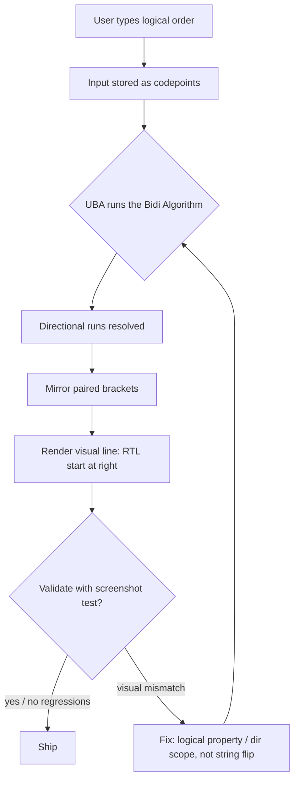

RTL ("right-to-left") support is the rare engineering problem where **the production bug lives in the browser's text algorithm, not in your code**. A Hebrew string can be stored, fetched, and rendered perfectly left-to-right and still display wrong the moment a number, an emoji, or an English product name shares the same line. I have spent the last ten years shipping products that must be correct in Hebrew, Arabic, and English at once, and the pattern that survives is not "add `dir="rtl"` and hope" — it is understanding the Unicode Bidi Algorithm and building the layout, locale, and test discipline around it. This post is the playbook.

## 1. The bidi algorithm is the actual bug surface

Every time you render a string with mixed-direction text, the browser runs the **Unicode Bidirectional Algorithm** (UBA, UAX #9). It walks the characters, classifies each into one of ~29 directionality types, and then applies a nested algorithm that *reorders* them for display without ever changing the underlying stored string. Most teams never learn it, so most RTL bugs are simply UBA mispredictions.

The three layers, from outer to inner:

- **Direction context.** `dir="rtl"` on the document or element sets the base direction. This decides which end of the line is the "start" (right, in RTL) and which is "end" (left).
- **The algorithm.** The UBA takes the directional runs and `mirror`s paired punctuation (parentheses, brackets, angle brackets, braces) so they face inward. `(English)` in an RTL line renders as a mirrored pair around the English text — a common source of "why are my parentheses backwards?" bugs.
- **Number handling.** In RTL text, Western digits (`123`) keep their own directionality (they form a "weak" left-to-right run) and the thousands separator and decimal point are rendered as the locale dictates — a comma is *not* automatically a decimal separator in every locale.

```python
# The dir() you never see: a demonstration of how the same string
# reorders for *display* while the stored value stays byte-identical.
# Visual order is a presentation-layer concern; logical order is the
# canonical source of truth for storage, search, and API payloads.
import unicodedata

sample = "English text עם עברית: 42 و60% عربي 5,000"
# Stored/logical order is exactly this string — never flip it.
for ch in sample:
    bidi = unicodedata.bidirectional(ch)
    if bidi in ("R", "AL", "RLE", "RLO"):
        pass  # strong right-to-left / Arabic letter
```

The lesson: **never try to "fix" a mixed-direction string by flipping it.** Store and transmit logical order; let the renderer apply the algorithm. The moment a developer starts reversing strings, they have already lost.



## 2. Write your layout in logical properties, not physical ones

The single highest-leverage change for RTL correctness is to stop writing `margin-left`, `padding-right`, `text-align: left`, and `float: left`, and instead write the **logical** properties that follow the writing direction: `margin-inline-start`, `padding-inline-end`, `text-align: start`, `inset-inline-start`.

```css
/* Physical (brittle): breaks the moment dir flips */
.chat-message {
  margin-left: 12px;        /* becomes wrong in RTL */
  padding-right: 16px;
  border-left: 3px solid;   /* the "attachment" border ends up on the wrong side */
}

/* Logical (direction-aware): correct in LTR and RTL with zero overrides */
.chat-message {
  margin-inline-start: 12px;
  padding-inline-end: 16px;
  border-inline-start: 3px solid;
}
```

When you use logical properties, the *same stylesheet* serves Hebrew, Arabic, and English. The alternative — physical properties plus a giant cascade of `[dir="rtl"]` overrides — is how "RTL support" becomes a 2,000-line patch of `!important` that nobody can maintain. I have walked into more than one codebase where the RTL layer was a separate file of hacks; every one of them would have been trivial with logical properties.

The same reasoning applies to alignment and iconography:

- **`text-align: start`** instead of `left` — cards, headings, and cell content reflow automatically.
- **Flexbox and grid** default to the writing direction for `flex-direction: row` and `grid` auto-placement, so a `row` begins at the right in RTL for free — but only if you don't hard-code `order` or a left/right margin.
- **Icons with motion** (arrows for "next", chevrons) should be *mirrored* in RTL. A "→" that means "forward" in English points the wrong way in Hebrew. Use `transform: scaleX(-1)` on a directional icon under `[dir="rtl"]`, or ship direction-aware icon sets.

## 3. Hebrew specifics beyond direction

Direction is the headline, but Hebrew ships its own set of traps that have nothing to do with the UBA:

- **Numbers, dates, and currency.** `10/05/2026` vs `05/10/2026` — Hebrew uses day/month/year by default. Reject any UI that hard-codes positions or assumes `en-US` digit grouping. Use the locale-aware formatter in your stack, never string interpolation.
- **Pluralization and gender.** Hebrew has singular/plural *and* grammatical gender, and unlike English it inflects adjectives and verbs. `"3 items"` becomes different strings for masculine vs. feminine nouns. A naive `count + " פריטים"` will look broken or wrong for many counts — use a proper pluralization/ICU message library with gender-aware rules, not `<count> items`.
- **Vowel points (niqqud) and typography.** Hebrew can be written with or without vowel marks. In user-facing copy, avoid niqqud in headings (sparser, reads cleaner); preserve it only where linguistic precision matters (educational or legal text). Also note Hebrew fonts have different metrics — a `font-family` tuned for Latin glyphs may render Hebrew letters cramped or with broken diacritics. Set a good Hebrew-capable fallback stack (`"Heebo", "Noto Sans Hebrew", "Open Sans Hebrew"`).
- **Slugs, URLs, and search.** A Hebrew slug like `https://site.com/עמוד-رئيسي` is valid but unwieldy. Decide a policy: keep Hebrew in the URL for SEO, or map to a transliterated/English slug and store the Hebrew as canonical via `hreflang` alternatives. And ensure full-text search is tokenizing on **Hebrew** (a search that only splits on ASCII whitespace treats Hebrew words as one opaque blob — CJK-style tokenizers won't help; you need per-language analyzers).

```css
/* A Hebrew-capable font stack that degrades gracefully */
:root {
  --font-hebrew: "Heebo", "Noto Sans Hebrew", "Open Sans Hebrew",
                 system-ui, sans-serif;
}
html[lang="he"] { font-family: var(--font-hebrew); }
html[lang="he"] { line-height: 1.7; }  /* Hebrew glyphs can need slightly more leading */
```

## 4. The layout reflow nobody tests (until it ships)

RTL is not just mirrored text — **the entire layout reflows**, and the failures show up where you least expect:

- **Fixed-width elements.** A sidebar 280px wide may fit its longest Hebrew menu item in LTR-width testing but truncate in RTL, because Hebrew strings of the same *character count* can be visually wider or wrap earlier. Test longest-string-per-locale, not sample text.
- **Tables and grids.** Columns reorder right-to-left. Data grids with sticky first columns, dragging handlers, and sorting arrows are the #1 place RTL breaks.
- **Overlays and dialogs.** A centered modal is fine, but a toast anchored to `top-right` is now the *front* of an RTL screen — it belongs at `top-start` (top-left). Use logical inset properties.
- **Charts and graphs.** Time series axes, legends, and data labels each need direction review. An X-axis that reads left-to-right contradicts a right-to-left page's mental model.

```js
// Angular/React pattern: drive direction + language off one locale
// source instead of scattering `dir` attributes.
const locale = "he-IL";               // Hebrew (Israel)
document.documentElement.setAttribute("dir",
  isRtl(locale) ? "rtl" : "ltr");     // base direction for the whole doc
document.documentElement.setAttribute("lang", "he");
```

## 5. The test discipline that makes RTL shippable

RTL correctness does not fall out of unit tests that only assert on values — the *rendering* is wrong while the *data* is right. You need three layers:

- **Unit tests for logic:** assert on logical values (never on visual/display strings). Verify date and number output via the locale formatter directly.
- **Golden visual tests / screenshots:** snapshot every key screen in both LTR and RTL. Diff against a baseline; a changed screenshot is a changed layout. This is the only reliable way to catch mirrored icons, truncated longest-strings, and misplaced borders.
- **A bidi+fuzz pass:** generate strings that mix Hebrew, Arabic, English, numbers, punctuation, and emoji — the exact conditions the UBA reorders — and assert the rendered layout matches an expected snapshot. Teams that skip this layer ship the parentheses-flip bug.

I add one escalation rule to every RTL effort: **longest-string and layout testing belong in CI, not in a manual QA sheet.** When a regression breaks a menu in Arabic, you want the pipeline to say so at commit time, not discover it in a release demo.

## Bring RTL and i18n discipline to your product

If your product serves even one Hebrew or Arabic market — or you plan to — RTL is not a sprint you bolt on after feature-complete; it is an architecture decision that touches layout, locale, fonts, search, and testing from day one. The cost of retrofitting is an order of magnitude higher than building it in. I spend 30 minutes with product and engineering teams reviewing their internationalization posture: whether layout is written in logical properties, how the bidi edge cases are handled, whether the test suite would actually catch an RTL regression, and how localization fits the roadmap — no obligation, and no product pitch.

Reach me directly at **wisamdamouny@gmail.com** or via the contact form below.