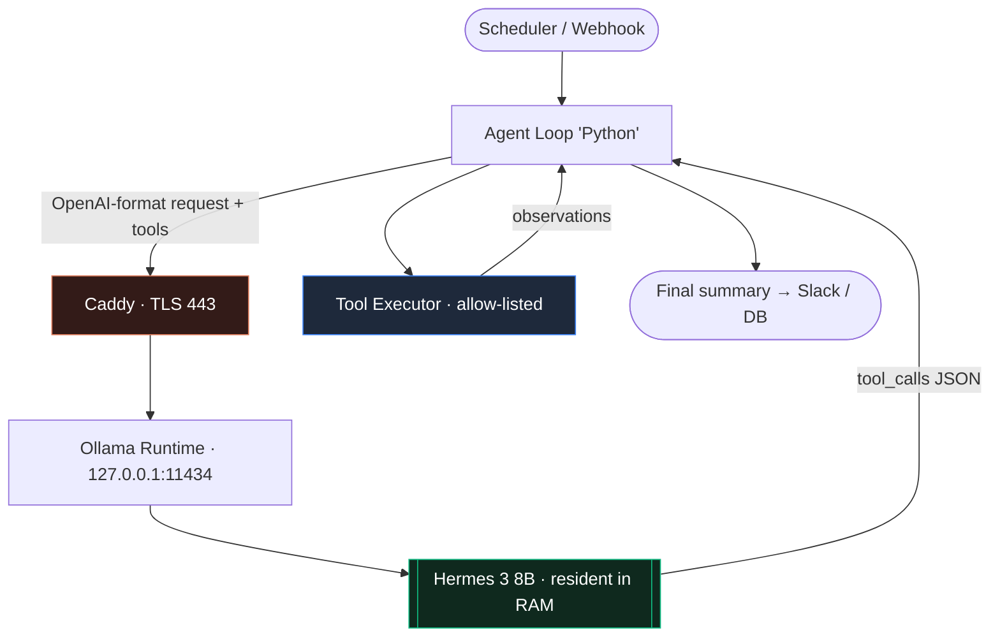

If you want a Hermes agent running with the least effort, Hostinger's [Managed Hermes Agent](https://www.hostinger.com/managed-hermes-agent) is a one-click deploy — I cover it in a [separate article](hermes-agent-on-hostinger.html). This piece is the other path: building the agent yourself on a bare VPS so you own the model, the data path, and every tool it can call. Nous Research's **Hermes 3** family — Llama-3.1-based, explicitly fine-tuned for structured tool calling — is small enough to self-host and capable enough to drive a real agent loop. Here is the 8B variant as an autonomous agent on a single **Hostinger KVM VPS**, from bare provisioning to a TLS-terminated endpoint.

<div style="border:1px solid var(--accent); border-radius:12px; padding:20px 24px; margin:32px 0; background:rgba(217,119,87,0.08);">
  <strong style="color:var(--fg); display:block; margin-bottom:8px;">Managed or DIY?</strong>
  <p style="margin:0; color:var(--fg-muted); font-size:16px;">Choose <a href="https://www.hostinger.com/cart?product=hagents%3Astarter&amp;period=12&amp;referral_type=cart_link&amp;REFERRALCODE=NHJWISAMDKAY&amp;referral_id=01a04384-666a-7361-bf76-90025e9ce5a8" style="color:var(--accent); font-weight:600;">Managed Hermes Agent</a> (20% off, Starter plan) if you want the agent, not the plumbing — patching and uptime are handled. Choose the DIY route below if you need a specific model, an air-gapped data path, or custom tooling — the same <strong>20% off</strong> applies to a VPS: <a href="https://www.hostinger.com?REFERRALCODE=NHJWISAMDKAY" style="color:var(--accent); font-weight:600;">hostinger.com &rarr; 20% off</a>.</p>
</div>

## 1. Why Hermes, and why a plain VPS

Hermes 3 8B is a practical sweet spot for self-hosting:

- **Tool calling is native.** The model was trained on function-call formatting, so you get reliable JSON tool invocations without heavy prompt gymnastics.
- **It fits in RAM.** A `Q4_K_M` GGUF quantisation of the 8B model is roughly 5 GB on disk and needs ~8–10 GB of RAM to serve with a usable context window.
- **CPU inference is good enough for agents.** Agent workloads are bursty and tolerant of a few seconds of latency per step — very different from a chat UI that needs 30+ tokens/sec.

That last point matters, because it means you do **not** need a GPU instance. A CPU-only KVM VPS with enough vCPUs and RAM will comfortably run an 8B model at 6–12 tokens/sec, which is plenty for background automation, scheduled research tasks, or a Slack bot that answers every few minutes.

> For an 8B agent, target at least 4 vCPU and 16 GB RAM; 8 vCPU / 32 GB if you want headroom for a bigger context window or a second model. I run this on Hostinger's KVM 4 / KVM 8 tier.

## 2. First-boot hardening

Once the VPS is provisioned, Hostinger gives you a root SSH login and an IP. Do the boring security work first.

```bash
# On the VPS, as root
adduser hermes && usermod -aG sudo hermes
rsync --archive --chown=hermes:hermes ~/.ssh /home/hermes

# /etc/ssh/sshd_config
#   PermitRootLogin no
#   PasswordAuthentication no
systemctl restart ssh

# Firewall: SSH + HTTPS only. The model port stays internal.
ufw allow OpenSSH
ufw allow 443/tcp
ufw enable

# 8B inference is memory-hungry at load time — add swap as a safety net
fallocate -l 4G /swapfile && chmod 600 /swapfile
mkswap /swapfile && swapon /swapfile
echo '/swapfile none swap sw 0 0' >> /etc/fstab
```

> Never expose the raw model port (`11434`) to the public internet. It has no authentication. Everything external goes through the reverse proxy in section 6.

## 3. Serving Hermes with Ollama

Ollama is the fastest path to an OpenAI-compatible endpoint for a GGUF model. Install it, pull Hermes 3, and confirm it answers.

```bash
curl -fsSL https://ollama.com/install.sh | sh

# Pull the 8B Hermes 3 build (Q4_K_M quant)
ollama pull hermes3:8b

# Smoke test the OpenAI-compatible route
curl http://127.0.0.1:11434/v1/chat/completions \
  -H "Content-Type: application/json" \
  -d '{
    "model": "hermes3:8b",
    "messages": [{"role": "user", "content": "Reply with just: ok"}]
  }'
```

Pin a few environment defaults so the service behaves predictably under an agent's rapid-fire calls:

```bash
mkdir -p /etc/systemd/system/ollama.service.d
cat > /etc/systemd/system/ollama.service.d/override.conf <<'EOF'
[Service]
Environment="OLLAMA_KEEP_ALIVE=-1"
Environment="OLLAMA_NUM_PARALLEL=1"
Environment="OLLAMA_CONTEXT_LENGTH=8192"
EOF
systemctl daemon-reload && systemctl restart ollama
```

`OLLAMA_KEEP_ALIVE=-1` keeps the model resident in RAM so you do not pay a cold-load penalty on every agent step. `OLLAMA_NUM_PARALLEL=1` keeps memory predictable on a CPU box.

## 4. The agent loop

An agent is just a loop: send the conversation plus a tool catalogue to the model, execute whatever tool it asks for, append the result, repeat until it stops calling tools. Because Ollama speaks the OpenAI wire format, the standard SDK works unchanged — you only swap the `base_url`.

```python
import json, subprocess, requests
from openai import OpenAI

client = OpenAI(base_url="http://127.0.0.1:11434/v1", api_key="local")

TOOLS = [{
    "type": "function",
    "function": {
        "name": "run_shell",
        "description": "Run a read-only shell command on the host and return stdout.",
        "parameters": {
            "type": "object",
            "properties": {"cmd": {"type": "string"}},
            "required": ["cmd"],
        },
    },
}, {
    "type": "function",
    "function": {
        "name": "http_get",
        "description": "Fetch a URL and return the response body as text.",
        "parameters": {
            "type": "object",
            "properties": {"url": {"type": "string"}},
            "required": ["url"],
        },
    },
}]

def execute(name, args):
    if name == "run_shell":
        # allow-list enforced elsewhere; keep tool surfaces tiny
        return subprocess.run(args["cmd"], shell=True, capture_output=True,
                              text=True, timeout=30).stdout[:4000]
    if name == "http_get":
        return requests.get(args["url"], timeout=15).text[:4000]
    return f"unknown tool: {name}"

def run_agent(task: str, max_steps: int = 8):
    messages = [
        {"role": "system", "content": "You are an autonomous ops agent. "
         "Use tools to gather facts before answering. Stop when the task is done."},
        {"role": "user", "content": task},
    ]
    for _ in range(max_steps):
        resp = client.chat.completions.create(
            model="hermes3:8b", messages=messages, tools=TOOLS, temperature=0.2,
        )
        msg = resp.choices[0].message
        messages.append(msg)
        if not msg.tool_calls:
            return msg.content
        for call in msg.tool_calls:
            result = execute(call.function.name,
                             json.loads(call.function.arguments))
            messages.append({"role": "tool", "tool_call_id": call.id,
                             "content": str(result)})
    return "step budget exhausted"

if __name__ == "__main__":
    print(run_agent("Check disk usage and the current uptime, then summarise system health."))
```

The important design choices are the same ones that apply to any production agent: a **hard step budget**, **truncated tool output** so a runaway `cat` cannot blow the context window, and a **tiny tool surface** with allow-listing enforced in `execute()` rather than trusted to the prompt.

## 5. Request flow



## 6. TLS and authentication with Caddy

If the agent runs on the same box as the model, you are done — talk to `127.0.0.1` and nothing else needs to be public. If the agent, a webhook, or a teammate needs to reach the model from outside, put **Caddy** in front so you get automatic Let's Encrypt certificates and a bearer-token gate.

```caddy
# /etc/caddy/Caddyfile
hermes.example.com {
    @unauthorised not header Authorization "Bearer {env.HERMES_TOKEN}"
    respond @unauthorised 401

    reverse_proxy 127.0.0.1:11434
}
```

```bash
export HERMES_TOKEN="$(openssl rand -hex 24)"
systemctl restart caddy
```

Point your DNS `A` record at the VPS, and the endpoint becomes `https://hermes.example.com/v1/...` with a token your agent sends as `api_key`. The firewall from section 2 already blocks every other port.

## 7. Cost and sizing notes

- **8B Q4** is the honest ceiling for CPU-only inference. Expect 6–12 tok/sec on 4–8 vCPUs; fine for agents, not for a chat product.
- **70B** needs a GPU. Hostinger's KVM range is CPU-only, so if you outgrow 8B the move is a dedicated GPU host, not a bigger VPS.
- **Context is the memory cost.** Going from 8k to 32k context roughly triples KV-cache RAM. Size the plan for the context you actually use.
- Keeping the model **resident** (`OLLAMA_KEEP_ALIVE=-1`) trades a few GB of idle RAM for removing multi-second cold starts on every agent run. On an agent box, always make that trade.

## Conclusion

A single CPU VPS, an 8B tool-calling model, and about forty lines of loop code is enough to run a genuinely autonomous agent that you fully control — no per-token metering, no data leaving your box, no upstream deprecation notices. If that control is not a hard requirement, the [managed one-click deploy](hermes-agent-on-hostinger.html) will get you there in minutes instead. Pick the level of ownership the workload actually needs.

<p style="font-size:13px; color:var(--fg-subtle); font-style:italic; border-top:1px solid var(--card-border); padding-top:16px; margin-top:40px;">Affiliate disclosure: the Hostinger links in this article are referral links. If you buy a plan through one you get 20% off and I may receive a commission, at no extra cost to you. I use Hostinger VPS instances for the setup described above.</p>
