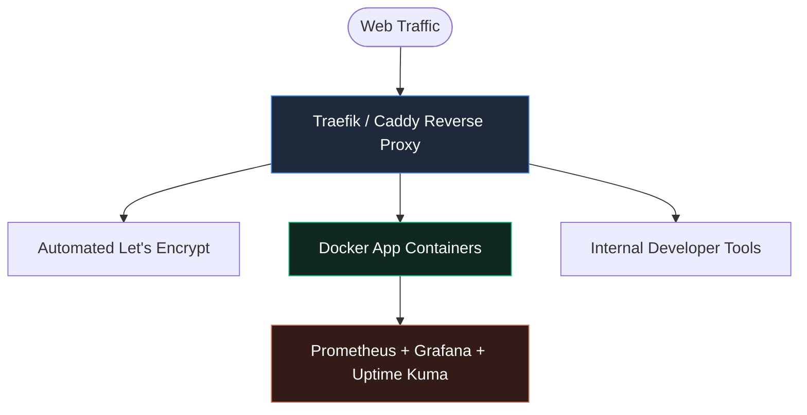

Relying exclusively on proprietary cloud SaaS platforms often leads to ballooning operational costs, vendor lock-in, and unpredictable API changes. Self-hosting core developer tooling and infrastructure restores full operational control.

## 1. Why Self-Host Internal Software?

Through building platforms like **ikando.tech** and **zrikat.com**, self-hosted Docker and VPS infrastructure cut recurring cloud expenses by over 70% while improving data privacy compliance.

## 2. Infrastructure Architecture Overview

## 3. The Self-Hosted Infrastructure Stack

- **Reverse Proxy & SSL:** Automated Traefik / Caddy with automated Let's Encrypt renewal.
- **Container Orchestration:** Lightweight Docker Compose / Portainer setups with blue-green deployment scripts.
- **Telemetry & Monitoring:** Self-hosted Prometheus, Grafana, and Uptime Kuma alerts.

## 4. Key Takeaway

Self-hosting is no longer just for hobbyists — it is a strategic business decision for software leaders seeking performance, security ownership, and fiscal efficiency.
