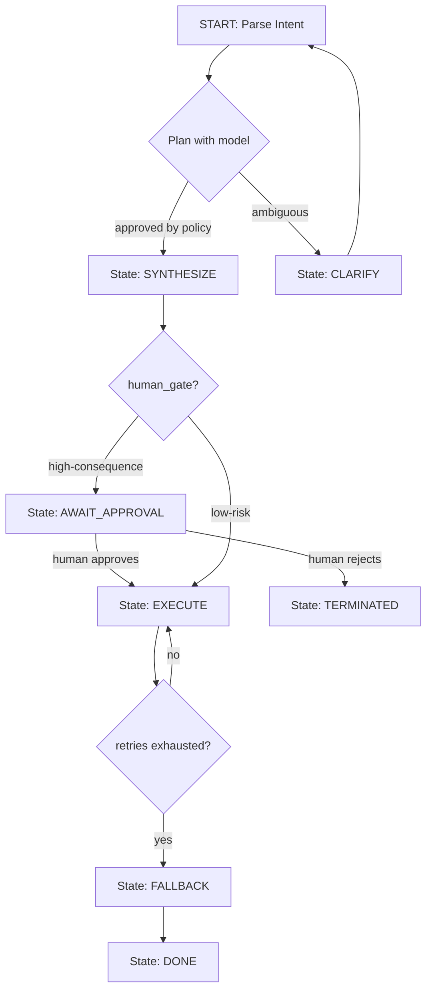

The difference between a demo agent and a production agent is rarely the model. It is almost always the **control flow**. A demo wires a prompt to a tool with `if/else` glue and hopes. A production agent knows exactly where it is, what it is allowed to do at each point, how to pause for a human, and how to resume after a crash. That is what a **state graph** gives you: the orchestration layer that turns a stochastic model into a deterministic, inspectable, resumable machine.

I have spent the last ten years building systems that must be responsible at 2 a.m., and the pattern that survives contact with auditors, compliance officers, and angry customers is the same one every time. This post is the state-graph orchestrator I reach for — how to model states, gate the transitions that matter, checkpoint so nothing is lost, and design fallbacks so a stuck agent fails cleanly instead of failing loudly.

## 1. Why raw LLM control flow does not scale

When a team first builds an agent, they often do it as a single long prompt: *"Do X, then Y, then Z, and call these tools."* It works in the demo. In production it collapses for three structural reasons:

- **No defined states.** The model improvises its next action from whatever the last tool returned, so there is no single place you can look to answer *"what is this agent doing right now?"*
- **Unbounded loops.** A retry loop that should stop and escalate instead spins, each iteration paying an LLM call and mutating state.
- **No resume point.** If the orchestrator dies mid-task, everything it did is lost and the run restarts from zero — or worse, restarts and repeats a side effect.

A state graph replaces all three with structure. Instead of asking the model *"what should you do next?"*, you ask it *"which transition out of this explicit state do you take?"* The set of possibilities is bounded, auditable, and safe.



## 2. States, transitions, and a schema you can serialize

The core idea is that an agent run is a **finite state machine**, not a monologue. You define a finite set of states, a set of allowed transitions between them, and a small payload that rides with the run. In LangGraph land that looks like this:

```python
from typing import TypedDict, Literal

class AgentState(TypedDict):
    request_id: str          # stable, survives restarts
    intent: str
    steps_taken: int
    policy_version: int
    status: Literal["parsed", "planned", "awaiting_approval",
                    "executing", "done", "fallback", "terminated"]

from langgraph.graph import StateGraph

builder = StateGraph(AgentState)
builder.add_node("parse_intent", parse_intent)
builder.add_node("plan", plan_with_model)
builder.add_node("execute", execute_tool)
builder.add_node("escalate", escalate_for_approval)

builder.add_edge("parse_intent", "plan")
builder.add_conditional_edges(
    "plan",
    decide_gate,                       # classifier -> which transition?
    {"proceed": "execute", "escalate": "escalate", "clarify": "parse_intent"},
)
```

Three things make this production-grade rather than demo-grade:

- **Typed state.** Every transition reads and writes a strongly typed state object. You can serialize it, log it, and replay it — which is the foundation of the audit trail.
- **Bounded transitions.** The model does not choose an arbitrary next action; it chooses one of N named edges. Even if the model behaves badly, it can only reach the states you designed.
- **Deterministic identity.** The `request_id` survives the whole run, so a checkpoint, a crash, and a resume all reference the same logical task.

## 3. The human-in-the-loop gate is a state, not a callback

Almost every serious agent-automation failure is an agent acting with *unearned authority*. The fix is not to remove autonomy; it is to make approval an **explicit state** in the graph, not a detached callback. When a transition leads to a high-consequence action, the orchestrator moves to `AWAIT_APPROVAL` and *stops*. No clock ticks, no hidden retry — the run is simply paused at a defined point with a defined payload.

```text
AgentState.Status = "awaiting_approval"
  payload: { action, target, risk_class, token_scope_required }

  on human_approve(task_id)  -> status = "executing"
  on human_reject(task_id)   -> status = "terminated"
  on timeout(task_id)        -> status = "terminated"   # fail closed
```

This is the same human-in-the-loop pattern regular readers will recognize from my posts on agent architecture and sandboxing — and state graphs are the *mechanism* that makes it first-class. It is deterministic, testable, and non-negotiable. The gate between *intent* and *execution* is not a nice-to-have; it is the difference between a system you trust and a system you babysit.

## 4. Checkpointing: cheap persistence, failover for free

A state graph's biggest operational win is that because the *entire state* is a serializable object, you can **persist it after every transition** for nearly free. That persistence is what makes resumability and retry possible without re-doing side effects.

```python
checkpointer = SqliteSaver.from_conn_string("checkpoints.db")
app = builder.compile(checkpointer=checkpointer)

# Resume a run by its thread_id; the graph picks up exactly
# where it stopped, with its prior state intact.
thread = {"configurable": {"thread_id": state["request_id"]}}
result = app.invoke(new_input, config=thread)
```

The value appears the moment something fails:

- **Orchestrator crash?** Restart the process, resume each in-flight `request_id` from its last checkpointed state. No work lost.
- **Tool call idempotency?** Because you persist state *before* executing a side-effecting tool, you never re-run a transition you already completed. The state is the source of truth for what has happened.
- **Audit for free.** The checkpoint log is already a chronological, immutable record of every state the run entered — the same data an auditor asks for, without building a separate pipeline.

## 5. Fallback and max-retry: design the failure before it happens

Every graph needs an explicit answer to the question *"what happens when this is stuck?"* Bounded retries and a fallback node are the two mechanisms, and both must be *part of the graph*, not exceptions thrown at the last minute.

```yaml
retry_policy:
  max_attempts: 3
  backoff: [1s, 5s, 15s]
  on_exhausted:
    route_to: "fallback"        # a real state, not an exception
fallback:
  actions:
    - notify_operator
    - mark_request "needs_review"
    - do_not_auto_retry
```

The discipline is that a stuck run **fails closed into a reviewable state** rather than burning tokens or repeating mutations. This is the engineering equivalent of a circuit breaker: when a dependency is misbehaving, you stop amplifying it and route to a controlled shutdown. Your operations team gets a clean, single row saying *"run X hit its retry budget and is parked for review,"* instead of a pager storm.

## 6. Observability falls out of the graph

Because every run is a sequence of named states, observability stops being a bolt-on and becomes a property of the system. Each transition is a natural event with a timestamp, a `request_id`, and the state delta. This composes directly with the OpenTelemetry tracing and trajectory logging I covered in my post on multi-agent auditability — the graph *is* the trace.

- **Where is every agent right now?** Group runs by current state. One dashboard query.
- **Where do agents get stuck?** Alarm on time-in-state exceeding a threshold. The bottleneck is a named state, not a mystery.
- **What did this run do?** Replay the checkpoint log. Compliance sign-off in minutes.

## Bring state graph orchestration to your agent stack

If your team's agent is structured as a long prompt or `if/else` glue, you are carrying the structural failure modes that state graphs eliminate — and they will surface the first time a run matters at 2 a.m. I spend 30 minutes with senior teams reviewing their agent orchestration: whether states and transitions are explicit, where the human-in-the-loop gates belong, how checkpoints and fallbacks are wired, and what your audit trail actually proves. No obligation, and no product pitch.

Reach me directly at **wisamdamouny@gmail.com** or via the contact form below.