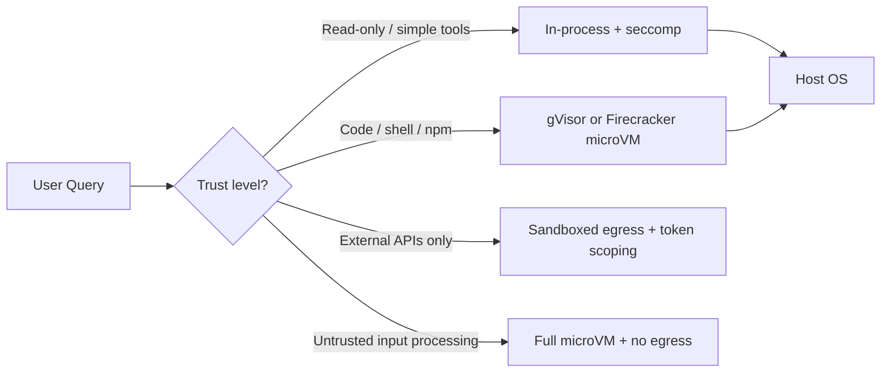

An agent is a new, untrusted user that can run code, call your APIs, and mutate state — and the most debated part of a production AI system is not the model, it is *where the tools execute*. I have seen teams replace a convincing demo with a production incident in one afternoon because the agent had full host access and "just knew" how to call the runbook. This post is the sandboxing layer I put between an agent and anything that matters: what is worth isolating, which isolation primitives to reach for at each trust level, and the permission gate that turns "the agent can do it" into "the agent can do it after a human or policy says so."

## 1. The threat model is the design brief

Before choosing a sandbox, write down what fails. For an enterprise agent that reads your database, writes tickets, and triggers deploys, the realistic failure modes are not a rogue model plotting world domination. They are banal and specific:

- **Prompt-injected commands.** An LLM reads an untrusted document containing `curl ... | sh` and, if the model has a shell tool, faithfully executes it. This is the #1 incident source in practice.
- **Billion-dollar loop.** A retry loop that punches through an idempotency guard and writes the same billing row forty thousand times.
- **Privilege amplification.** The agent holds a token with more scope than the task needs, and any compromise inherits that scope.
- **Data exfiltration.** The agent reads a sensitive file while processing, and a later step posts it to a public endpoint.

The principle is simple: **an agent must never run with the privileges of the human orchestrating it.** It runs with the minimum privilege its current task requires, inside an environment that can fail closed. Sandboxing is how you make that true without making the agent unusable.

The decision tree that follows is about choosing the *thinnest* boundary that contains the agent's blast radius at each risk tier.

## 2. Pick isolation by trust level

Sandboxes are not one size. I bucket tool execution into four tiers, each with a different boundary:



- **Tier 1 — in-process with seccomp.** For tools that only call well-known APIs, run them in a worker thread fenced off by a `seccomp` allowlist of syscalls plus resource limits. Fastest; sufficient for read-only operations.
- **Tier 2 — user-space sandbox.** For tools that execute code or scripts but don't need the host kernel — think `node` for a headless browser task, or a LISP/JS eval. A user-space sandbox like gVisor's `runsc` or a `bwrap` bubblewrap layer gives you syscall interception without a full VM.
- **Tier 3 — microVM.** For anything that runs untrusted, third-party, or genuinely arbitrary code, use a Firecracker or Cloud Hypervisor microVM with a read-only rootfs and no network by default. Boot times are 100–200ms, so the cost is low enough to use per-call.
- **Tier 4 — in / out anonymizer.** For processing untrusted documents, the microVM also gets **no outbound network** unless the task explicitly needs it, and if it does, it goes through an egress proxy that filters destinations.

Every tier still needs the two cross-cutting controls below: a syscall policy and an egress policy.

## 3. syscalls: the allowlist that does the heavy lifting

On Linux, the boundary your agent actually feels is the kernel syscall surface. `seccomp-bpf` lets you deny everything except an allowlist. Working from an allowlist (not a deny list) is the whole game — deny lists always leak one stray syscall you hadn't thought of.

A pragmatic start for a typed, single-purpose tool runner is a *reserved* set of syscalls:

```c
// seccomp filter sketch: allow only the syscalls a
// function-calling tool runner needs; kill everything else
#define MAX_SYSCALLS 256

struct sock_filter filter[] = {
    /* all-or-nothing default: kill the process */
    BPF_STMT(BPF_RET | BPF_K, SECCOMP_RET_KILL_PROCESS),
    /* ...then insert explicit BPF_JUMP allow rules for: */
    /* read write close fcntl ioctl clock_gettime getpid   */
    /* mmap munmap mprotect exit exit_group (your subset)  */
};
```

The exact whitelist depends on your runtime, but the discipline is identical: **deny by default, then add back only what the tool provably needs.** When you add a syscall, you add it with the reasoning, not because a stack trace complained once.

If your tool runtime needs more syscalls than a comfortable allowlist allows, or you need to filter at the *network* and *file-path* level rather than the syscall level, move from raw seccomp to a syscall-intercepting user-space sandbox (gVisor `runsc`) or to eBPF-based filtering with tools like `bpftrace`/`badger` for visibility and `LVE` for enforcement. The principle is unchanged — you are shrinking the kernel surface the untrusted code sees.

## 4. Egress control: the firewall is the GDPR layer

Almost every serious leak in an agent system is not syscall abuse — it is the agent phoning home, or phoning out. An agent with a `.env` in scope and a working internet connection is a DIMM slot away from an outbound POST. The fix is that an agent's network is a proxy you control, not a pipe to the world.

Concretely, per tool invocation pass a scoped, short-lived token and route all outbound traffic through an egress filter that answers one question: *is this destination one this task is permitted to reach?* Deny by default, then allow a small set:

```yaml
# per-sandbox egress policy (deny-by-default)
egress:
  default: deny
  allow:
    - host: "api.qlik.example"
      tls: required
      token_scope: "tickets:write"
    - host: "pypi.org"            # only for build/verify steps
      tls: required
  deny:
    - host: "*"                   # everything else fails closed
      reason: "not in task allowlist"
```

The two most overlooked details: the token scope travels with the request (so a compromise of the sandbox does not bequeath a long-lived credential), and the policy is attached to the *task*, not to the model or the tool. Change the task, change the policy.

## 5. Files: read-only rootfs, tmpfs working dir, no host writes

File access is where agents blunder into production. The rule is: **the sandbox rootfs is read-only, the working directory is an ephemeral tmpfs, and there is no mount of host paths by default.** Anything the agent must produce is staged out through an explicit, policy-checked handoff rather than an implicit write.

```python
# build a lower-layer rootfs for the microVM (read-only),
# an upper tmpfs for the working dir, and NO host mounts
def make_sandbox_root():
    return overlay_fs(
        lower=["/opt/agent/rootfs"],   # read-only base
        upper="/dev/shm/work",          # ephemeral, no persistence
        workdir="/tmp/overlay-work",
        no_host_mounts=True,
    )
```

If an agent needs to read a real file, mount a *scoped, read-only copy* or give it the redacted content via a temporary object-store read, not the live file. If it needs to write, the write lands in a staging bucket that requires a human or an approving system to promote. You buy back one thing with all this friction: **an agent cannot irreversibly destroy or silently exfiltrate state it was never given access to touch.**

## 6. The permission gate: sandbox ≠ authority

A sandbox isolates *blast radius*. It does not *authorize* anything. The two are complementary and both mandatory. I pair every sandbox with an explicit permission gate that lives **between request and execution**, mirroring the human-in-the-loop pattern regular readers will recognize from my posts on agent architecture:

```text
Agent intent --> classify: risky? 
   -> if yes --> STOP --> human approval (or policy permits)
   --> issue scoped token for this one execution
   --> run in sandbox with that token's egress/file scopes
   --> enforce quota/idempotency --> record trajectory
```

High-consequence executions (write paths, billing, deploys, anything touching PII) always stop at the gate. Low-risk read-only steps proceed but still record their trajectory. The sandbox makes the blast radius small; the gate decides which explosions are allowed at all. Ship both, and an agent becomes a tool you can be responsible for at 2 a.m., because a runaway call dies inside the sandbox instead of inside your database.

## Get a sandboxing review of your agent stack

If your team's agents have tool access and you are not certain what that means for your blast radius, I will spend 30 minutes reviewing your tool execution layer — isolation boundaries, syscall policy, egress control, and permission gates — and hand you a concrete list of what is production-safe and what is not. No obligation, and no product pitch.

Reach me directly at **wisamdamouny@gmail.com** or via the contact form below.